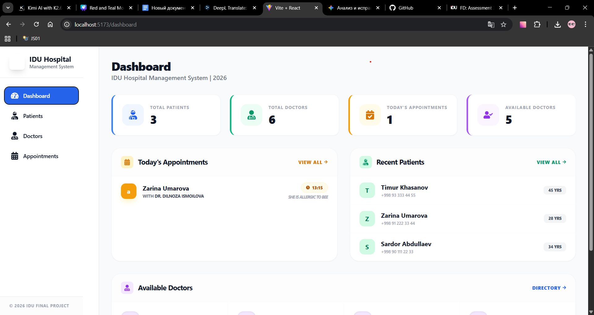
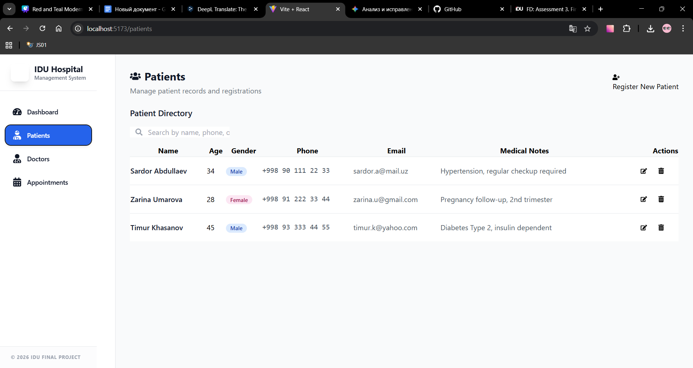
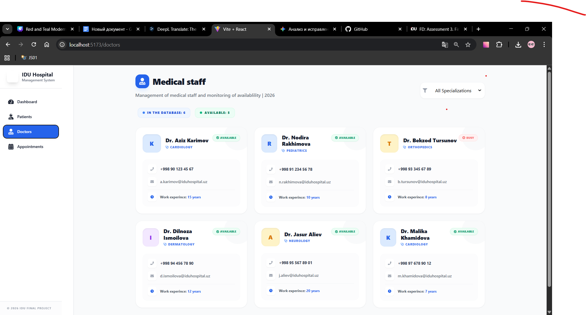
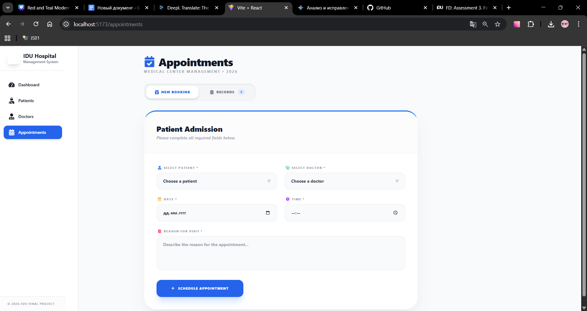
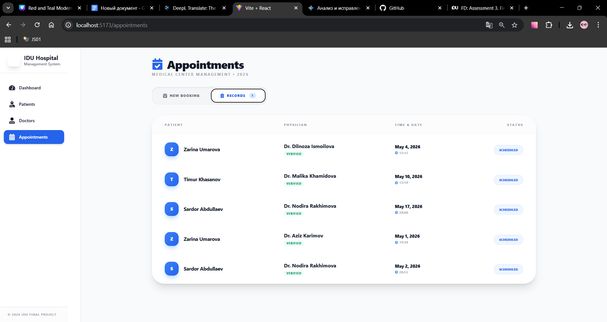

# Hospital Management System 🏥

### Описание проекта

Интерактивное веб-приложение для управления клиникой. Продукт создан для упрощения регистрации пациентов и организации работы медицинского персонала.

### Основные возможности

- **Dashboard:** Визуализация статистики клиники в реальном времени.
- **Patient Management:** Полный цикл регистрации и ведения базы пациентов.
- **Doctor Directory:** Каталог врачей с фильтрацией по специализациям.
- **Responsive Design:** Полная адаптивность для работы на смартфонах и планшетах.

### Стек технологий

- **Core:** React.js + Vite
- **Styling:** Tailwind CSS
- **Icons:** React Icons
- **Storage:** Браузерное хранилище LocalStorage[cite: 1]

### Скриншоты

### Инструкция по запуску

1. Склонируйте репозиторий: `git clone [https://github.com/safina-abd/hospital-management-system.git]`
2. Установите зависимости: `npm install`[cite: 1]
3. Запустите проект: `npm run dev`[cite: 1]
